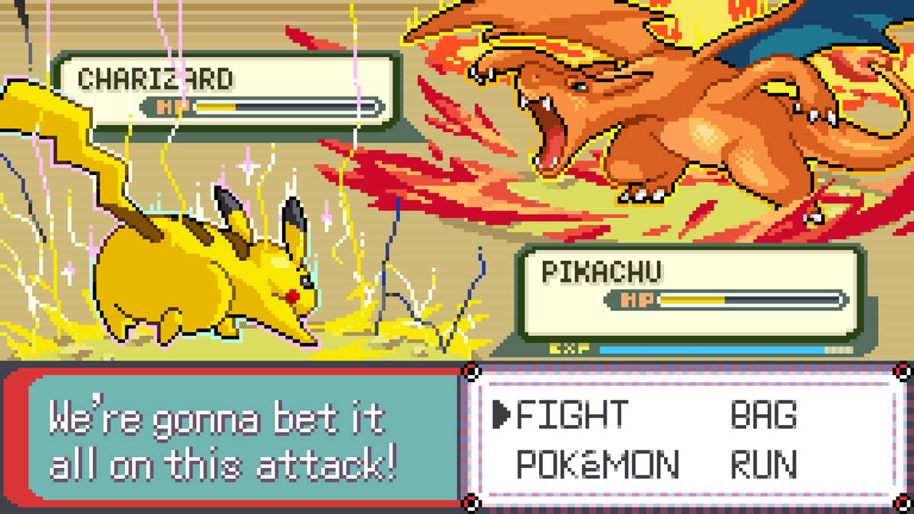

# PKMN_BTTL



This project is a simple Bitcoin-Pokemon game created to showcase BitVMX, a protocol that enables verifying arbitrary computations on Bitcoin. In this game, players choose a Pokemon to battle against Charizard. If their Pokemon wins, they can validate the result using BitVMX and claim locked Bitcoin funds.

You can read more about the game in the [following article](https://blog.rootstock.io/noticia/pkmn_bttl-a-pokemon-battle-game-written-in-zig-and-executed-with-bitvmx/) and more about BitVMX [here](https://bitvmx.org/).

---

NOTE: the [first article](https://blog.rootstock.io/noticia/pkmn_bttl-a-pokemon-battle-game-written-in-zig-and-executed-with-bitvmx/) is based on the `regtest` branch, while `master` branch corresponds to the second part of the article where we run the game on Mutinynet.

## Requirements

- Zig 0.13.0
- Rust
- Docker
- Clone all the submodules
  - `bitvmx_protocol` submodule must point `bitvmx_pkmn_bttl` branch
- Python (optional)

## Structure

```bash
.
├── bitvmx_protocol/ # BitVMX (submodule)
├── engine/ # Pokemon battle engine (submodule)
├── game_runs/ # Detailed data about game runs in each environment (mutinynet and regtest)
├── pkmn_bttl/ # The game
├── build.sh # Build script for 'pkmn_bttl'
├── build_test_input.sh # Build script for 'test_input' (an out of scope and reduced BitVMX program example)
├── init.sh # Initialization script
├── img.jpg
└── README.md
```

## Initialization

- Run the initialization script `init.sh`

```bash
./init.sh
```

This script clones the right submodules and creates the necessary folders.

## Run

Running the game involves setting up a BitVMX environment and acting as a prover that tries to compute the right output. To do that you can follow the next steps:

- Specify the input at `build.sh` INPUT and build the Pokemon program by running the build script
  - This validates that the program succeeds and moves the generated binary into the required folders for later verification.

```bash
./build.sh
```

- Run `prover` and `verifier` docker services.
  - at `bitvmx_protocol/`
  - `docker compose up prover-backend`
  - `docker compose up verifier-backend`
- Generate setup parameters by running `bitvmx_protocol/setup_mutiny.py`.
- Fund the generated address.
  - You can use the [Mutinynet faucet](https://faucet.mutinynet.com/).
- Open the Swagger UI at `http://0.0.0.0:8081/docs#/v1`
- Call `setup/` endpoint with the generated parameters
  - Remember to replace `funding_tx_id` and `funding_index`
- Call `input/` with the `setup_uuid` generated in the previous step.
- Call `next_step` with the same `setup_uuid` to verify the game (program).
  - You can modify `bitvmx_protocol/../execution_trace_generation_service.py` to try different challenge scenarios.
