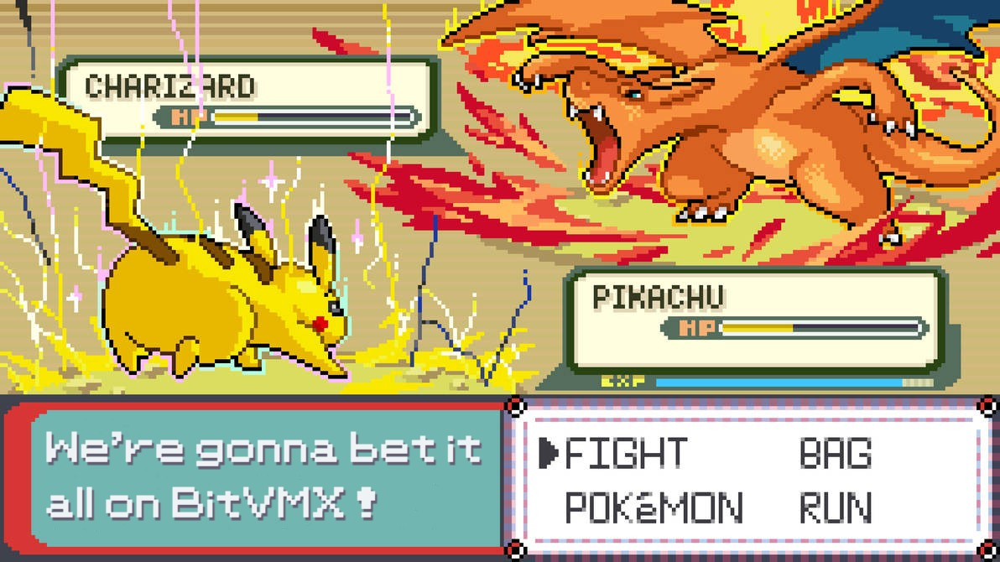

# PKMN_BTTL



This project is a simple Bitcoin-Pokemon game created to showcase BitVMX, a protocol that enables verifying arbitrary computations on Bitcoin. In this game, players choose a Pokemon to battle against Charizard. If their Pokemon wins, they can validate the result using BitVMX and claim locked Bitcoin funds.

You can read more about the game in the [following article](https://blog.rootstock.io/noticia/pkmn_bttl-a-pokemon-battle-game-written-in-zig-and-executed-with-bitvmx/) and more about BitVMX [here](https://bitvmx.org/).

## Requirements

- Zig 0.13.0
- Rust
- Docker
- Clone all the submodules
  - `bitvmx_protocol` submodule must point `bitvmx_pkmn_bttl` branch
- Python (optional)

## Structure

```bash
.
├── bitvmx_protocol/ # BitVMX (submodule)
├── engine/ # Pokemon battle engine (submodule)
├── pkmn_bttl/ # The game
├── build.sh # Build script for 'pkmn_bttl' (builds the game, runs it on the CPU emulator and places the output in the necessary folders)
├── build_test_input.sh # Build script for 'test_input' (a reduced example)
├── init.sh # Initialization script (clones submodules, creates aux folders and '.env_' files)
├── img.jpg
├── README.md
└── game_run_details.md # Detailed explanation of the game run (linked in the article)
```

## Run

Running the game involves setting up a BitVMX environment and acting as a prover that tries to compute the right output. To do that you can follow the next steps:

- Run the initialization script `init.sh`

```bash
./init.sh
```

- Specify the selected input at `build.sh` INPUT and build the Pokemon program by running the build script
  - This validates (optional) that the program succeeds using the right input and moves it into the required folders.

```bash
./build.sh
```

- Last, but definitely not least, setup a BitVMX environment and validate the proof (the program with the right input) as explained in the [article](https://blog.rootstock.io/noticia/pkmn_bttl-a-pokemon-battle-game-written-in-zig-and-executed-with-bitvmx/) :).
  - Start from "Running on Bitcoin - Step 5. Start services"
  - You can modify `bitvmx_protocol/../execution_trace_generation_service.py` to try different challenge scenarios.
